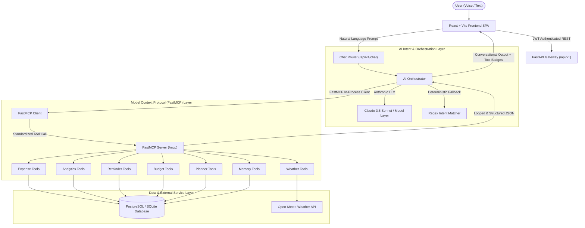

# 🚀 AI Life Manager — Context-Aware Personal AI Assistant Powered by FastMCP

[](https://ai-life-manager-two.vercel.app)
[](https://modelcontextprotocol.io/)
[](https://fastapi.tiangolo.com/)
[](https://react.dev/)
[]()
[]()

> **AI Life Manager** is a full-stack, production-grade personal AI operating system that harnesses the **Model Context Protocol (FastMCP)** to safely connect Large Language Models with financial analytics, expense tracking, task scheduling, live weather forecasting, and persistent memory.

---

## 🌐 Live Production Deployment

👉 **Live Frontend App:** **[https://ai-life-manager-two.vercel.app](https://ai-life-manager-two.vercel.app)**  
👉 **GitHub Repository:** **[https://github.com/bhaskibhaskar007/ai-life-manager](https://github.com/bhaskibhaskar007/ai-life-manager)**

> ⚡ **Evaluation Demo Mode**: On the login screen, simply click **"⚡ Instant 1-Click Demo Evaluation Mode"** to test without creating an account.

---

## 🌟 Core Innovations

1. **Native FastMCP Server**: Genuine Model Context Protocol architecture with typed schemas, structured outputs, in-process client bridging, and tool execution observability.
2. **Context-Aware Day Planner**: Synthesizes real-time reminders, live precipitation forecasts from Open-Meteo, and safe daily spending guidelines based on remaining monthly budget.
3. **Deterministic Safe Math**: Zero `eval()`; calculations use exact `Decimal` arithmetic with safe percentage change handling.
4. **Voice & Multimodal Interface**: Native Web Speech API integration with real-time waveform visualizer, text-to-speech spoken summaries, and tool invocation badge indicators.
5. **Modern SaaS Visual Dashboard**: Interactive Recharts graphs (weekly trajectory, category doughnut, daily bar charts, budget utilization meters, 28-day spending activity heatmap).
6. **Strict Multi-User Security**: JWT authentication with Argon2 / PBKDF2 password hashing, rate limiting, and database user isolation.

---

## 🏛️ System Architecture



---

## 🛠️ FastMCP Tool Registry

| Tool Group | Tools Included | Description |
| :--- | :--- | :--- |
| **Expense** | `add_expense`, `get_expenses`, `update_expense`, `delete_expense`, `get_expense_summary`, `get_category_breakdown`, `compare_weekly_expenses`, `get_spending_trend` | Full transaction management and comparison. |
| **Analytics** | `calculate_weekly_total`, `calculate_previous_week_total`, `calculate_percentage_change`, `detect_spending_trend`, `detect_unusual_expense`, `generate_financial_insight` | Safe calculations, anomaly detection (>2.5x mean), and plain-language insights. |
| **Reminder** | `create_reminder`, `list_reminders`, `update_reminder`, `complete_reminder`, `delete_reminder` | Priority-based task scheduling and recurring reminders. |
| **Budget** | `create_budget`, `get_budget`, `calculate_remaining_budget`, `detect_budget_risk` | Category and overall spending limits with utilization alerts. |
| **Day Planner**| `plan_day` | Synthesizes daily schedule blocks from active reminders, weather, and budget limits. |
| **Weather** | `get_current_weather`, `get_forecast` | Real-time weather and precipitation alerts via Open-Meteo (no API key required). |
| **Memory** | `save_user_preference`, `get_user_preference`, `save_user_context`, `retrieve_relevant_context` | Safe allow-listed preference storage and multi-turn conversational context. |

---

## 🚀 Quickstart Guide (Local Development)

### 1. Backend Setup
```bash
cd backend
python -m venv venv
# On Windows:
venv\Scripts\activate
# On Linux/macOS:
source venv/bin/activate

pip install -r requirements.txt
cp .env.example .env

# Run database migrations
alembic upgrade head

# Start FastAPI + FastMCP server
uvicorn app.main:app --reload --port 8000
```

### 2. Frontend Setup
```bash
cd frontend
npm install
npm run dev
```

Visit **http://localhost:5173** to access the local dashboard.

---

## 🧪 Running the Test Suite

```bash
# Run all unit and integration tests across all modules
pytest backend/tests -v
```
Output:
```
============================= 80 passed in 18.61s =============================
```

---

## 📚 Project Documentation

- [System Architecture](docs/architecture.md)
- [FastMCP Tool Registry](docs/mcp-tools.md)
- [REST API Reference](docs/api.md)
- [Production Deployment Guide](docs/deployment.md)
- [Academic Major Project Report](docs/project-report.md)

---

## 📄 License
This project is licensed under the MIT License.
